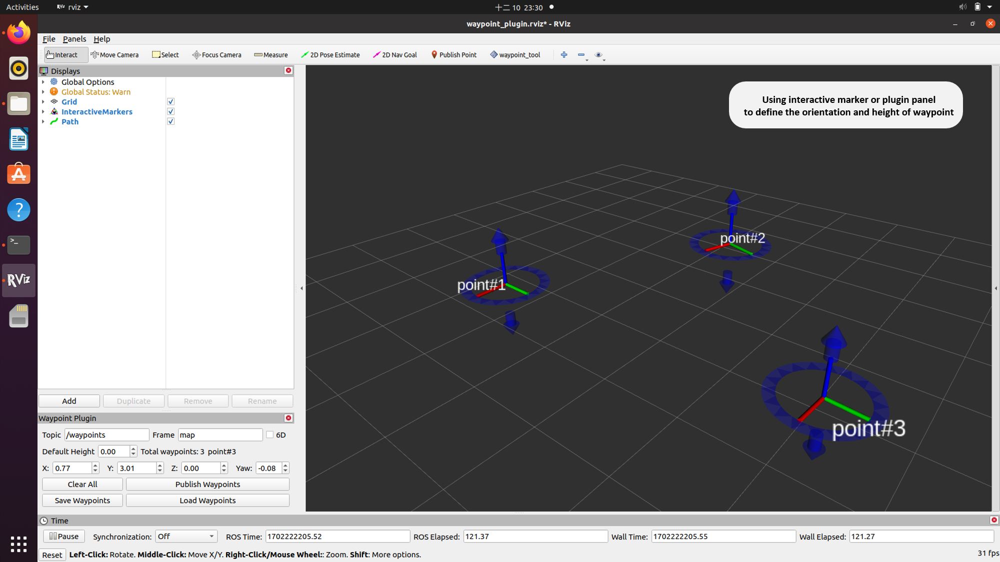
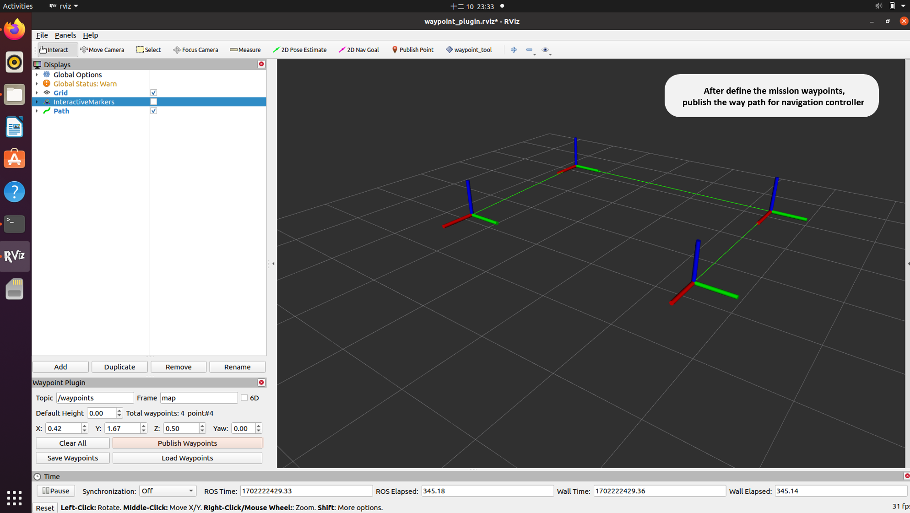

# waypoint plugin
## 1. Overview
An interactive waypoint plugin based on the plugin [release](https://github.com/KumarRobotics/waypoint_navigation_plugin/tree/master). This plugin offers a user-friendly interface to define and manage waypoints efficiently. This integration empowers users to easily interact with the robotic system, establishing a seamless workflow for waypoint setup and management.

### Build
* `$ cd catkin_ws/src`
* `$ git clone https://github.com/KoKoLates/waypoint-plugin.git`
* `$ cd .. && catkin_make install`
* `$ source devel/setup.bash`

### Launch
* Testing with launch file.
* `$ roslaunch waypoint_plugin rviz.launch`

## 2. Quick Start
To utilize the plugin in RViz, start by adding it from the toolbar. Once added, subscribe to the interactive marker and path messages to visualize and manipulate the waypoints. Additionally, you can employ the panel to make adjustments to the waypoints and save/load them using `ROS bag` functionality. This streamlined process enhances the ease of visualizing, modifying, and managing waypoints within RViz.
 

  

 

After configuring the waypoints, simply click the 'publish' button, and the /waypoints topic will be published. By subscribing to this topic from another controller node, the navigation functionality can be implemented seamlessly. This process ensures that the waypoints are effectively communicated between the components, facilitating the smooth execution of navigation tasks.
 

  

